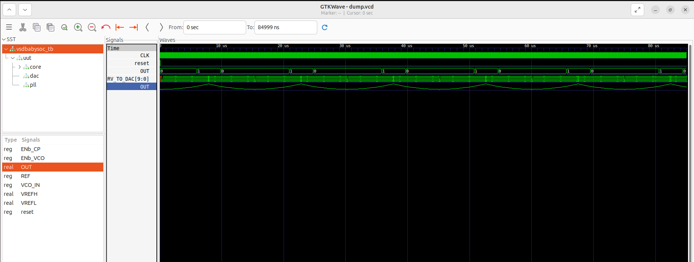
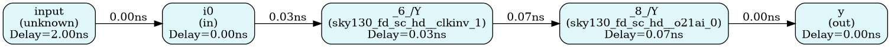

## GLS of Post-synthesis
This Readme.md file consists of my part1 tasks of week3 in RISC-V Tapeout Program.
## Objectives of Part 1 of Week 3
- Perform the synthesis of BabySoc
- Run Gate Level Synthesis using synthesized netlist
- Compare the results of the GLS output and the functional simulation output(week 2).

## 🛠 Toolchain Overview

- We rely on a fully open-source stack:

- Icarus Verilog → RTL & GLS simulation

- Yosys → Logic synthesis with Sky130 library

- GTKWave → Waveform inspection

## 1.Synthesis with Yosys

Analog IPs (avsddac, avsdpll) are modeled as stubs (black boxes) during synthesis.

Example:
```verilog
module avsddac (
   output OUT,
   input [9:0] D,
   input VREFH,
   input VREFL
);
// Black-box definition
endmodule
```

Synthesis flow (Yosys):
```bash
read_liberty -lib src/lib/sky130_fd_sc_hd__tt_025C_1v80.lib
read_liberty -lib src/lib/avsddac.lib
read_liberty -lib src/lib/avsdpll.lib
read_verilog src/module/vsdbabysoc.v
read_verilog -I src/include src/module/rvmyth.v
read_verilog -I src/include src/module/clk_gate.v
read_verilog src/module/avsddac_stub.v
read_verilog src/module/avsdpll_stub.v
synth -top vsdbabysoc
dfflibmap -liberty src/lib/sky130_fd_sc_hd__tt_025C_1v80.lib
opt
abc -liberty src/lib/sky130_fd_sc_hd__tt_025C_1v80.lib
flatten
setundef -zero
clean -purge
rename -enumerate
write_verilog -noattr VSDBabySoC/src/module/vsdbabysoc_netlist.v
stat -liberty src/lib/sky130_fd_sc_hd__tt_025C_1v80.lib
show vsdbabysoc
```

✅ Produces gate-level netlist and synthesis statistics.

## 3️⃣ Gate-Level Simulation (GLS)

Once synthesized, simulate the netlist to validate RTL equivalence:
``` bash
iverilog -DFUNCTIONAL -DUNIT_DELAY=#1 -I src/gls_model \
  -o output/post_synth_sim/post_synth_sim.out \
  src/module/testbench.rvmyth.post-routing.v src/module/testbench.v \
  src/gls_model/primitives.v src/gls_model/sky130_fd_sc_hd.v \
  output/synthesized/vsdbabysoc.synth.v src/module/avsdpll.v src/module/avsddac.v
```
```bash
cd output/post_synth_sim
./post_synth_sim.out
gtkwave dump.vcd
```

✅ GLS waveforms line up with RTL — functional equivalence achieved!



## Comparison with week2's output:
.png)

## ✅ The results of GLS outputs and functional simulation output match.

## Key takeaways:
- GLS validates synthesized design using the netlist and ensures outputs match RTL simulation
- Steps: Synthesize -> Run GLS -> Compare Outputs.
- Observations: GLS may reveal  timing issues but functionality must remain correct.
- STA checks timing for critcal paths, slack, and setup/hold violations.

## Generate Timing Graph with OpenSTA

This README file consists of part 3 work of my week3 in RISC-V SoC Tapeoout Program

## Objectives:

- Understand and perform Gate Level Synthesis(GLS) after the synthesis.
- Validate Functionality
- Introduction to Static Timing Analysis concepts with practical experiments using OpenSTA

## Week 3 Lab – Gate-Level Simulation & Timing Graphs with OpenSTA
## 1️⃣ Environment Setup:
- Installation of cmake:
``` bash
sudo apt update
sudo apt install -y cmake
```
- Install CUDD
``` bash
git clone https://github.com/ivmai/cudd.git
cd cudd
autoreconf -i
./configure --prefix=/usr/local
make -j$(nproc)
sudo make install
```
- Build OpenSTA
``` bash
git clone https://github.com/The-OpenROAD-Project/OpenSTA.git
cd OpenSTA
mkdir build
cd build
cmake -DCUDD_DIR=/usr/local ..
make -j$(nproc)
```
## 2️⃣ OpenSTA procedures
## 1. Visualising timing graph of vsdbabysoc.synth.v netlist.
- Created a opensta_script.tcl based on the netlist text file to open them in sta.
- Run command
  ``` bash
  sta opensta_script.tcl
  ```
 This created:
- clock_report.text
- unconstrained_report.txt
- install graphviz
``` bash
sudo apt install graphviz
pip install graphviz
```
- Created a python file sta_graph.py based on the netlist to visualize the timing graph.
``` bash
python3 sta_graph.py
```
This created:
- Timing_graph.png
- Timing_report.txt
✅ Timing graph has been generated.


## 2.Visualising timing graph of bad_mux_net.v netlist.
- Created a bad_mux_opensta.tcl based on the netlist text file to open them in sta.
- Run command
  ``` bash
  sta bad_mux_opensta.tcl
  ```
 This created:
- clock_report.text
- unconstrained_report.txt
- Created a python file sta2_graph.py based on the netlist to visualize the timing graph.
``` bash
python3 sta2_graph.py
```
This created:
- Timing_graph.png
- Timing_report.txt
✅ Timing graph has been generated.


## Observations:

- Critical Path: The longest delay path in the circuit that determines the maximum clock frequency.

- Slack: The difference between required and arrival time; negative slack indicates a timing violation.
