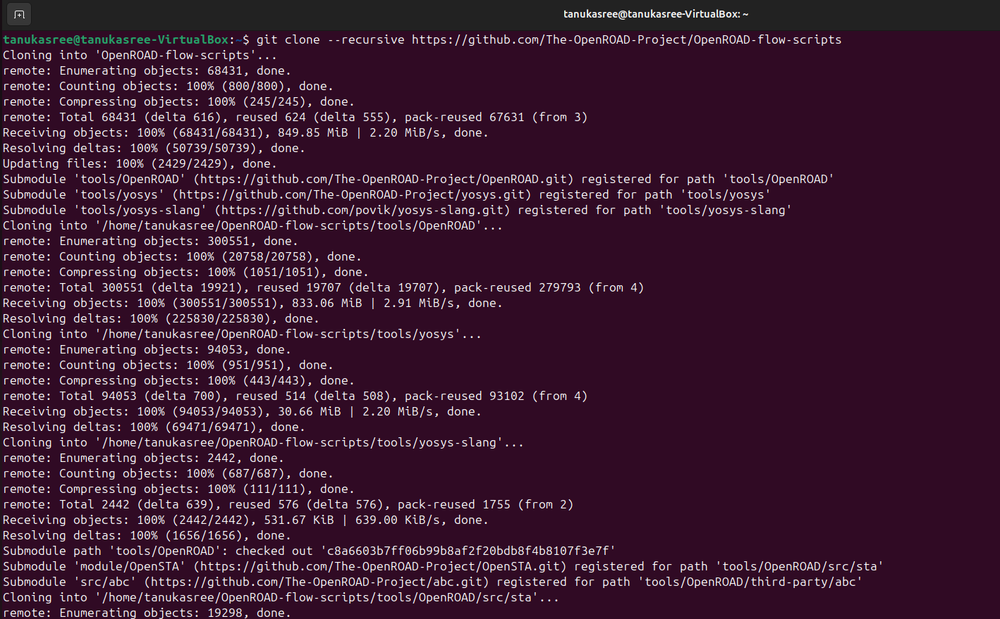
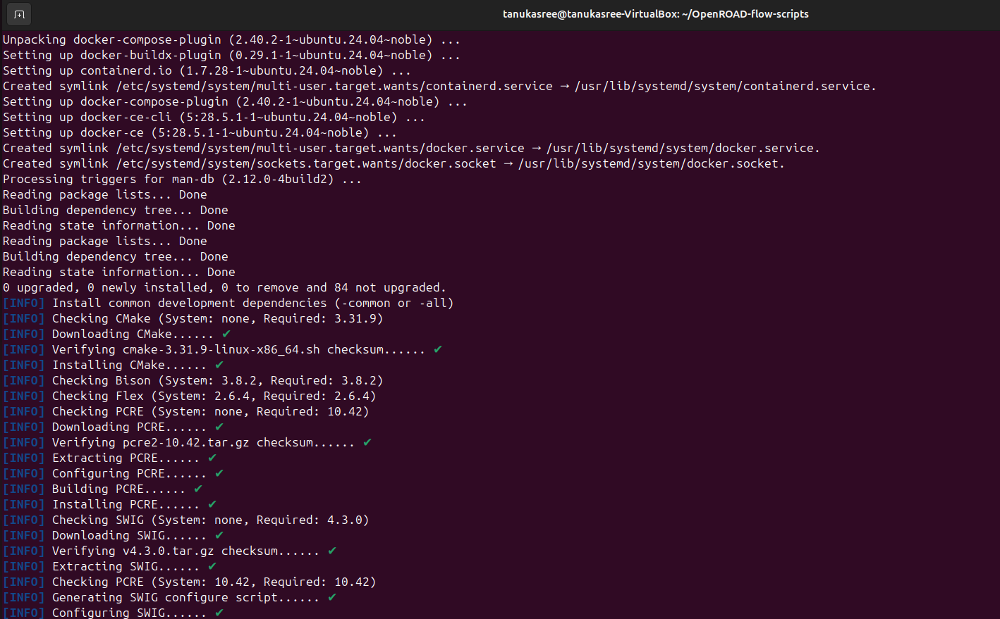
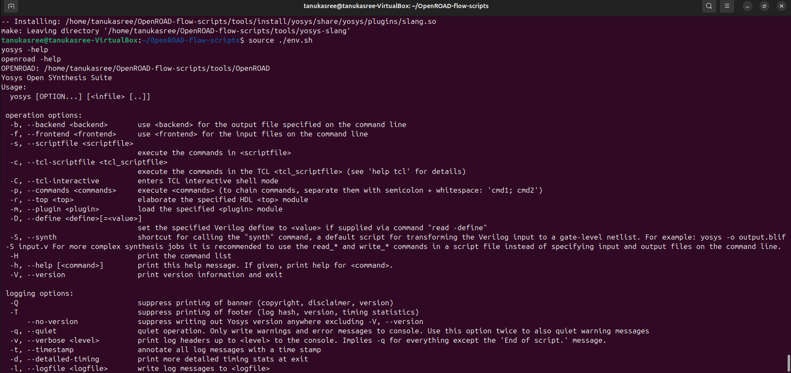
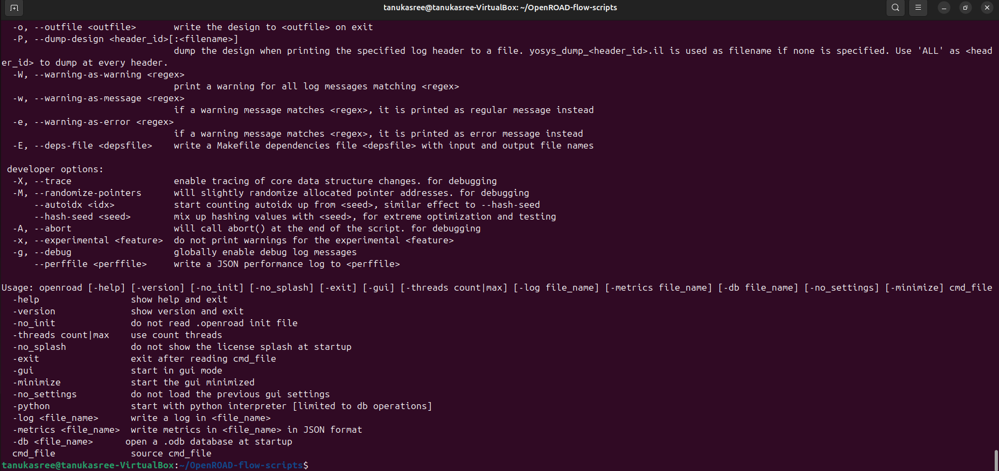
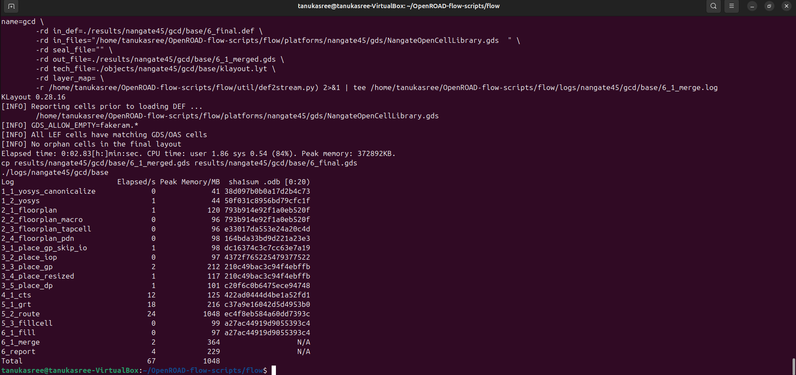
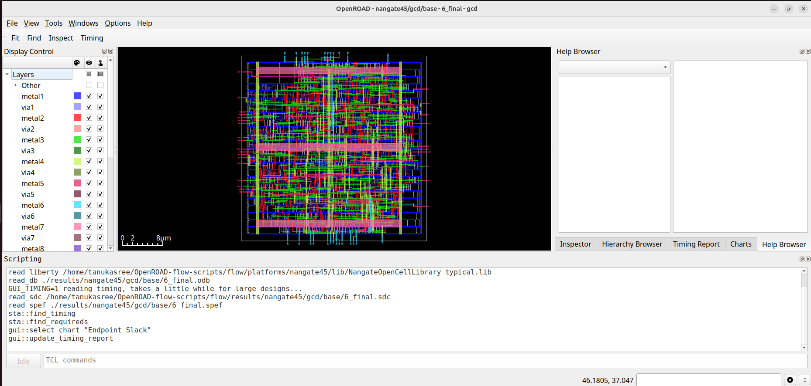
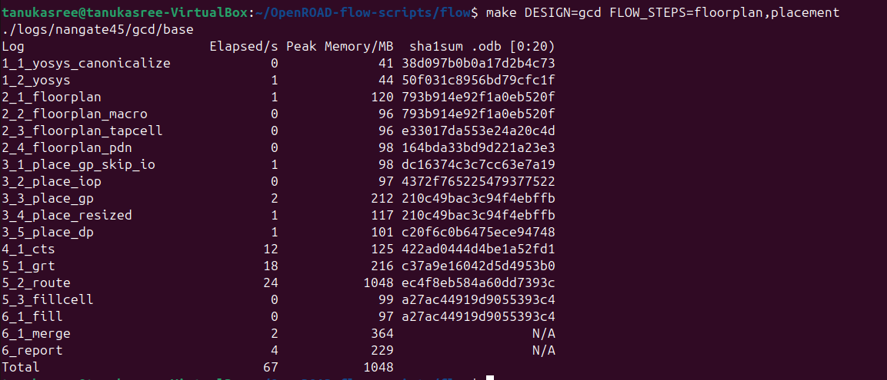
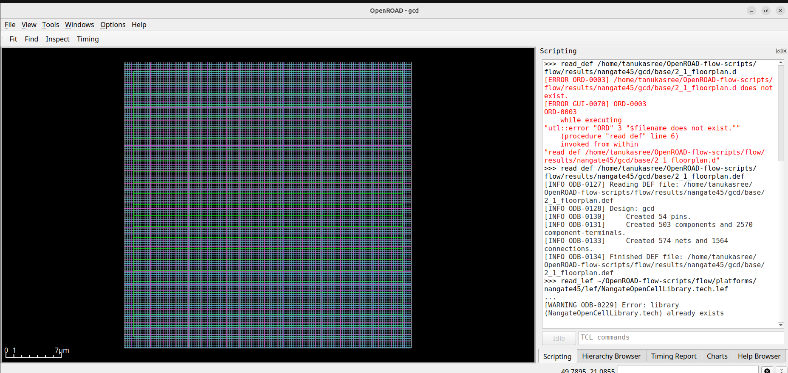

# 🖥️ Week 5 – OpenROAD Flow Setup & Floorplan + Placement
## 🎯 Objective

This repository documents the setup of OpenROAD Flow Scripts and demonstrates the execution of Floorplan and Placement stages for a simple digital design.

The goal is to transition from circuit-level design to backend physical implementation, preparing the design for eventual tape-out.

# Contents
# Steps to Install OpenROAD and Run GUI

 1. Clone the OpenROAD Repository
 2. Run the Setup Script
 3. Build OpenROAD
 4. Verify Installation
 5. Run the OpenROAD Flow
 6. Launch the GUI

## 1. Clone the OpenROAD Repository
```bash
git clone --recursive https://github.com/The-OpenROAD-Project/OpenROAD-flow-scripts
cd OpenROAD-flow-scripts
```

## 2. Run the Setup Script
```bash
sudo ./setup.sh
```

## 3. Build OpenROAD
```bash
./build_openroad.sh --local
```

## 4. Verify Installation
```bash
source ./env.sh
yosys -help  
openroad -help
```


## 5. Run the OpenROAD Flow
```bash
cd flow
make
```

## 6. Launch the GUI
```bash
 make gui_final
```


# Floorplan and placement

Practiced floorplanning and placement for gcd file in OpenROAD.
```bash
cd ~/OpenROAD-flow-scripts/flow
make DESIGN=gcd FLOW_STEPS=floorplan,placement
cd ~/OpenROAD-flow-scripts/flow/results/nangate45/gcd/base
```
```openroad
openroad> read_db 2_1_floorplan.odb
write_def 2_1_floorplan.def
exit
openroad> read_db 3_5_place_dp.odb
write_def 3_5_place_dp.def
exit
```
```bash
openroad -gui
```


## Openroad tcl commands:
- floorplan:
  ```tcl
  read_lef ~/OpenROAD-flow-scripts/flow/platforms/nangate45/lef/NangateOpenCellLibrary.tech.lef
  read_lef ~/OpenROAD-flow-scripts/flow/platforms/nangate45/lef/NangateOpenCellLibrary.macro.lef
  read_def ~/OpenROAD-flow-scripts/flow/results/nangate45/gcd/base/2_1_floorplan.def
  ```
  
- Placement:
  ```tcl
  read_lef ~/OpenROAD-flow-scripts/flow/platforms/nangate45/lef/NangateOpenCellLibrary.tech.lef
  read_lef ~/OpenROAD-flow-scripts/flow/platforms/nangate45/lef/NangateOpenCellLibrary.macro.lef
  read_db /home/tanuja/OpenROAD-flow-scripts/flow/results/nangate45/gcd/base/3_5_place_dp.odb
  ```
  
# Conclusion

- OpenROAD Flow Scripts were installed and configured successfully.

- Floorplan and Placement stages for the GCD design were executed.

- The task demonstrates a successful transition from logical design to backend physical implementation in VLSI.
