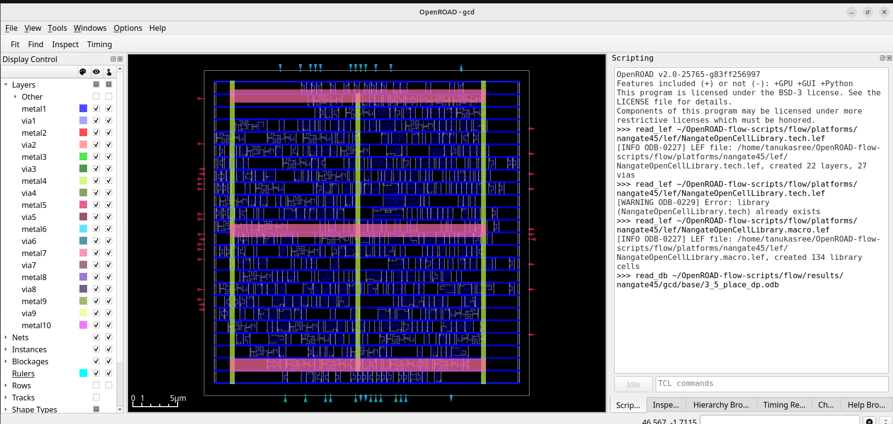
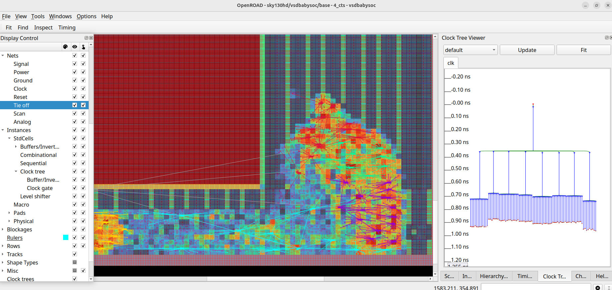
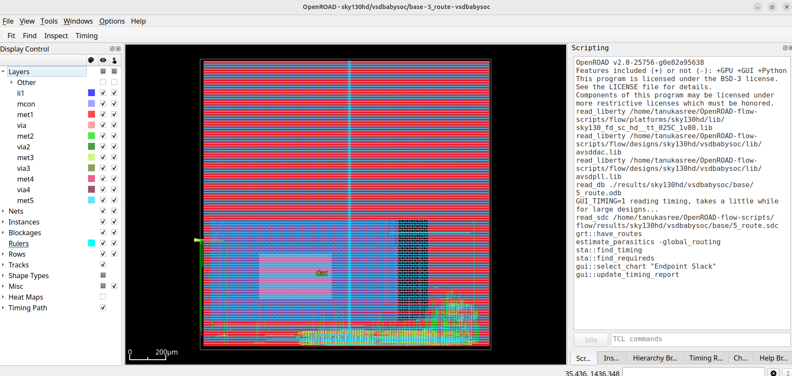

# RISC_V_SoC_Tapeout_Program_Week_8

This repository contains my continuation work of week 7 where I overcame the congestion error in the routing phase and my week 8 content of the 10 week RISC -V SoC tapeout project under the course VLSI System Design , at IIT Gandhinagar. The main objective of this week is to perform post layout Static Timing Analysis (STA) for the routed SoC design named ("VSDBabySoC") , using the parasitic data (SPEF) generated after routing.

# Objective:

- Correction of the congestion problem during routing process.
- BabySoC Physical Design and Post-Route SPEF
- Perform post-layout STA using extracted parasitics from routing(SPEF) for the VSDBabySoC design.

# This repository contains:
- Perfect routing after overcoming the congestion problem.
- sta.tcl -- TCL script automating the STA.
- vsdbabysoc.spef -- The post route SPEF file with parasitic RC data.
- Timing output files generated per corner(e,g WNS,TNS,slack reports) under ./sta_outputs/route/.
- Detailed slack / timing reports : sta_wns.txt , sta_tns.txt.sta_worst_max_slack.txt,sta_worst_min_slack.txt

# Congestion problem of the routing: 

⚠️ Routing did not complete successfully

The global routing stage failed due to congestion occurring across several regions of the design.

The tool reported the following error:
```
[ERROR GRT-0116] Global routing finished with congestion.
```
## Root Cause of Congestion

The congestion was primarily caused by pins being placed on metal layers that were not physically accessible to the router. This typically occurs due to one or more of the following issues:

- Obstructions (OBS) defined on macro pin layers

- Incorrect or incompatible LEF pin definitions

- Routing access blockages

- Pins assigned to improper or unreachable metal layers in the IP or hard macro

To resolve this issue, the avsdac.lef file was modified to correct the pin-layer definitions and eliminate the routing congestion.

# Final GDSII OUTPUTS:
- ## Floorplan

- ## Placement

- ## Clock Tree Synthesis

- ## Routing


# SPEF Generaation:
## DEF file creation:
Generation of a DEF file from OpenROAD database
```
cd ~/OpenROAD-flow-scripts
source env.sh

cd flow
openroad

read_db /home/tanukasree/OpenROAD-flow-scripts/flow/results/sky130hd/vsdbabysoc/base/5_route.odb

write_def /home/tanukasree/OpenROAD-flow-scripts/flow/results/sky130hd/vsdbabysoc/base/5_route.def
```

## Post route SPEF file generation:
- Start OpenRoad :
```
cd ~/OpenROAD-flow-scripts
source env.sh
cd flow/
openroad
```
## Load necessary LEF files: 
```
read_lef /home/tanukasree/OpenROAD-flow-scripts/flow/designs/sky130hd/vsdbabysoc/lef/sky130hd.lef
read_lef /home/tanukasree/OpenROAD-flow-scripts/flow/designs/sky130hd/vsdbabysoc/lef/avsdpll.lef
read_lef /home/tanukasree/OpenROAD-flow-scripts/flow/designs/sky130hd/vsdbabysoc/lef/avsddac.lef
```
## Load Timing Library File :
```
read_liberty /home/tanukasree/OpenROAD-flow-scripts/flow/platforms/sky130hd/lib/sky130_fd_sc_hd__tt_025C_1v80.lib
```
## Load the layout DEF:
```
read_def /home/tanukasree/OpenROAD-flow-scripts/flow/results/sky130hd/vsdbabysoc/base/5_route.def
```
## Create the exernal-resources/ directory inside ~/OpenROAD-flow-scripts and clone the open_pdks repository:
```
git clone https://github.com/RTimothyEdwards/open_pdks.git
```
## Define the extraction model file:
```
define_process_corner -ext_model_index 0 /home/tanukasree/OpenROAD-flow-scripts/external-resources/open_pdks/sky130/openlane/rules.openrcx.sky130A.nom.calibre
```
## Extract parasitics:
```
extract_parasitics -ext_model_file /home/tanukasree/OpenROAD-flow-scripts/external-resources/open_pdks/sky130/openlane/rules.openrcx.sky130A.nom.calibre
```
## Write the SPEF file:
```
write_spef /home/tanukasree/OpenROAD-flow-scripts/flow/designs/sky130hd/vsdbabysoc/vsdbabysoc.spef
```
## Export the post-route Verilog netlist:
```
write_verilog /home/tanukasree/OpenROAD-flow-scripts/flow/designs/sky130hd/vsdbabysoc/vsdbabysoc_post_place.v
```

## The generated SPEF file:


#  Static Timing Analysis:

Post Route Static Timing Analaysis is performed after routing to verify that the design meets timing across all relevant PVT corners. Routing introduces parasitic extractions and hence the post route STA make sures that the timng of the final layout(GDSII) is clean and perfect. This STA obtains Worst Negative Slack (WNS), Total Negative Slack(TNS), Setup/Hold slacks and more.

## SETUP:
This post route STA is performed by a tcl script which I named it as "sta.tcl"

``` tcl
#--------------------------------------------------------
#--------------------------------------------------------
  # Post Route Multi-corner STA Automation Script 
#--------------------------------------------------------
           # Author : Tanukasree
#--------------------------------------------------------
#--------------------------------------------------------

# Define list of timing libraries (corners)

set list_of_lib_files(1) "sky130_fd_sc_hd__tt_025C_1v80.lib"
 # set list_of_lib_files(2) "sky130_fd_sc_hd__ff_100C_1v65.lib"
 # set list_of_lib_files(3) "sky130_fd_sc_hd__ff_100C_1v95.lib"
 # set list_of_lib_files(4) "sky130_fd_sc_hd__ff_n40C_1v56.lib"
 # set list_of_lib_files(5) "sky130_fd_sc_hd__ff_n40C_1v65.lib"
 # set list_of_lib_files(6) "sky130_fd_sc_hd__ff_n40C_1v76.lib"
 # set list_of_lib_files(7) "sky130_fd_sc_hd__ss_100C_1v40.lib"
 # set list_of_lib_files(8) "sky130_fd_sc_hd__ss_100C_1v60.lib"
 # set list_of_lib_files(9) "sky130_fd_sc_hd__ss_n40C_1v28.lib"
 # set list_of_lib_files(10) "sky130_fd_sc_hd__ss_n40C_1v35.lib"
set list_of_lib_files(2) "sky130_fd_sc_hd__ss_n40C_1v40.lib"
 # set list_of_lib_files(12) "sky130_fd_sc_hd__ss_n40C_1v44.lib"
 # set list_of_lib_files(13) "sky130_fd_sc_hd__ss_n40C_1v76.lib"
set list_of_lib_files(3) "sky130_fd_sc_hd__ff_n40C_1v95.lib"
#---------------------------------------------
#  Load design libraries 
#---------------------------------------------

 read_liberty /home/tanukasree/OpenSTA/examples/timing_libs/avsdpll.lib
 read_liberty /home/tanukasree/OpenSTA/examples/timing_libs/avsddac.lib

#---------------------------------------------
#  Loop through each .lib file (corner)
#---------------------------------------------

 for {set i 1} {$i <= [array size list_of_lib_files]} {incr i} {

# Read design and constraints

 read_liberty /home/tanukasree/OpenSTA/examples/timing_libs/$list_of_lib_files($i)
 read_verilog /home/tanukasree/OpenROAD-flow-scripts/flow/designs/sky130hd/vsdbabysoc/vsdbabysoc_post_place.v
 link_design vsdbabysoc
 current_design
 read_sdc /home/tanukasree/OpenROAD-flow-scripts/flow/results/sky130hd/vsdbabysoc/base/4_cts.sdc
 read_spef /home/tanukasree/OpenROAD-flow-scripts/flow/results/sky130hd/vsdbabysoc/base/6_final.spef

 # Perform timing checks
 check_setup -verbose

#-----------------------------------------
# Generate detailed reports
#-----------------------------------------

 report_checks -path_delay min_max -fields {nets cap slew input_pins fanout} -digits {4} > /home/tanukasree/OpenROAD-flow-scripts/flow/results/sky130hd/vsdbabysoc/base/sta_output/route/min_max_$list_of_lib_files($i).txt

#---------------------------------------------------
# Save key metrics (WNS, TNS, Setup & Hold Slack )
#---------------------------------------------------

 exec echo "$list_of_lib_files($i)" >> /home/tanukasree/OpenROAD-flow-scripts/flow/results/sky130hd/vsdbabysoc/base/sta_output/route/sta_worst_max_slack.txt
 report_worst_slack -max -digits {4} >> //home/tanukasree/OpenROAD-flow-scripts/flow/results/sky130hd/vsdbabysoc/base/sta_output/route/sta_worst_max_slack.txt

 exec echo "$list_of_lib_files($i)" >> /home/tanukasree/OpenROAD-flow-scripts/flow/results/sky130hd/vsdbabysoc/base/sta_output/route/sta_worst_min_slack.txt
 report_worst_slack -min -digits {4} >> /home/tanukasree/OpenROAD-flow-scripts/flow/results/sky130hd/vsdbabysoc/base/sta_output/route/sta_worst_min_slack.txt

 exec echo "$list_of_lib_files($i)" >> /home/tanukasree/OpenROAD-flow-scripts/flow/results/sky130hd/vsdbabysoc/base/sta_output/route/sta_tns.txt
 report_tns -digits {4} >> /home/tanukasree/OpenROAD-flow-scripts/flow/results/sky130hd/vsdbabysoc/base/sta_output/route/sta_tns.txt

 exec echo "$list_of_lib_files($i)" >> /home/tanukasree/OpenROAD-flow-scripts/flow/results/sky130hd/vsdbabysoc/base/sta_output/route/sta_wns.txt
 report_wns -digits {4} >> /home/tanukasree/OpenROAD-flow-scripts/flow/results/sky130hd/vsdbabysoc/base/sta_output/route/sta_wns.txt
 }
```
## Running Post-Route STA
Post-route STA can now be executed:
```
sta sta.tcl
```
Once the STA completes, results are written to:
```
~/STA_OUTPUT/route/
```
## This directory contains detailed reports including:

- Worst Negative Slack (WNS) 
- Total Negative Slack (TNS)
- Worst setup slack
- Worst hold slack
  
I have attatched these reports in this repository :
- sta_tns.txt
- sta_wns.txt
- sta_worst_max_slack.txt
- sta_worst_min_slack.txt
- min_max_sky130_fd_sc_hd__ff_n40C_1v95.lib.txt
- min_max_sky130_fd_sc_hd__ss_n40C_1v40.lib.txt
- min_max_sky130_fd_sc_hd__tt_025C_1v80.lib.txt

These results help verify whether the design is timing-clean across all corners and indicate if additional optimization such as resizing, buffering, or routing adjustments is needed.
